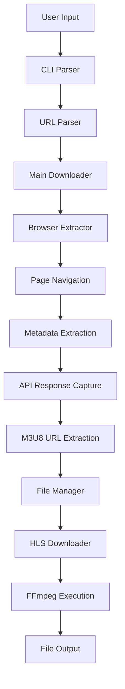
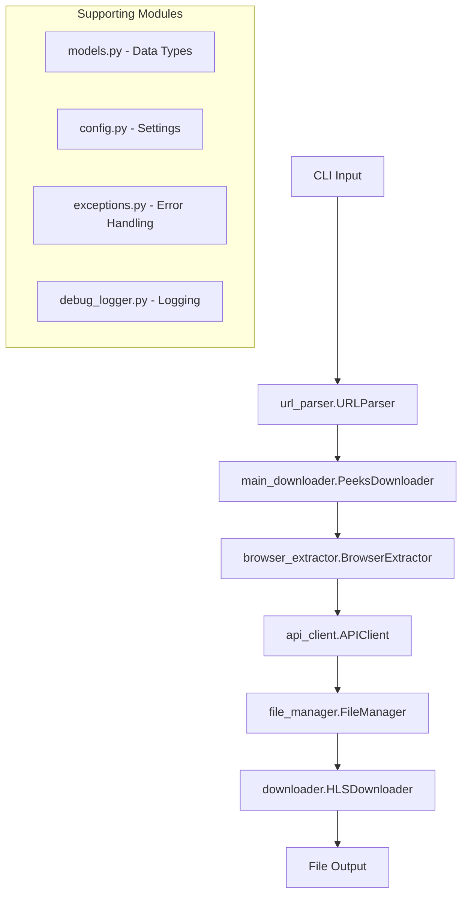

# Peeks.com Downloader - Architecture Guide

This document provides a detailed technical overview of the Peeks.com downloader architecture, focusing on the modular library structure and clean CLI organization.

## 📁 Project Structure Overview

```
web-downloader/
├── scripts/                        # 🎯 User-facing CLI tools
│   ├── peeks-downloader.py         # Main Peeks downloader (modular)
│   ├── peeks-api-downloader.py     # API-based downloader
│   ├── peeks-bulk-downloader.py    # Bulk download utility
│   ├── peeks-recent-streams.py     # Recent streams downloader
│   ├── instagram-downloader.py     # Instagram content downloader
│   ├── web_capture_cli.py          # Advanced web capture with HTML storage
│   ├── web-capture-simple.py       # Simplified web capture
│   ├── setup-api-key.py           # API key configuration
│   └── run_tests.py                # Test runner utility
├── lib/                            # 🏗️ Modular library architecture
│   ├── core/                       # 🔧 Core utilities and shared components
│   │   ├── core/                   # Base classes and interfaces
│   │   └── utils/                  # Shared utility functions
│   ├── capture/                    # 🌐 Advanced web capture framework  
│   │   ├── browser/                # Browser automation with HTML storage
│   │   ├── core/                   # Capture engine with session management
│   │   ├── network/                # Network interception and API detection
│   │   └── storage/                # Data models and file persistence
│   └── scrapers/                   # � Site-specific scrapers
│       ├── instagram/              # Instagram-specific modules
│       │   ├── auth.py            # Authentication handling
│       │   ├── cli.py             # CLI interface
│       │   └── extractor.py       # Content extraction
│       └── peeks/                  # 📺 Peeks.com specific modules
│           ├── __init__.py
│           ├── cli.py              # Command-line interface
│           ├── main_downloader.py  # Main orchestrator class
│           ├── browser_extractor.py # Browser automation & URL extraction
│           ├── downloader.py       # HLS/FFmpeg download handling
│           ├── api_client.py       # API interaction utilities
│           ├── network_client.py   # Network request handling
│           ├── url_parser.py       # URL parsing and validation
│           ├── file_manager.py     # File operations and naming
│           ├── models.py           # Data models and types
│           ├── config.py           # Configuration management
│           ├── exceptions.py       # Custom exception classes
│           ├── debug_logger.py     # Logging utilities
│           ├── framework_*.py      # Web capture framework integration
│           └── framework_manager.py # Framework orchestration
├── tests/                          # 🧪 Comprehensive test suite
│   ├── test_peeks*.py              # Peeks-specific tests
│   ├── instagram/                  # Instagram test modules
│   ├── web_capture_framework/      # Web capture tests
│   └── integration/                # Integration tests
├── docs/                           # 📚 Documentation
│   ├── README_PEEKS.md            # User guide
│   ├── README_PEEKS_ARCHITECTURE.md # This file
│   ├── TESTING.md                 # Test documentation
│   └── *.md                       # Other guides
├── config/                         # ⚙️ Configuration files
├── requirements.txt                # 📋 Python dependencies
└── README.md                       # 📖 Main project overview
```

## 🏗️ Architecture Overview

### Modular Design Philosophy

The project follows a clean modular architecture with clear separation of concerns:
#### 1. 🎯 **CLI Layer** (`scripts/`)
- **Purpose**: User-facing command-line tools
- **Architecture**: Clean, focused executables that import from `lib/`
- **Benefits**: Easy to use, clear entry points, consistent interface

#### 2. 🏗️ **Library Layer** (`lib/`)
- **Purpose**: Reusable, testable, enterprise-ready modules  
- **Architecture**: Multi-module object-oriented design
- **Benefits**: Code reuse, extensibility, comprehensive testing, maintainability

#### 3. 🎯 **Site-Specific Scrapers** (`lib/scrapers/`)
- **Purpose**: Specialized extraction logic for different websites
- **Architecture**: Modular scrapers with common interfaces
- **Benefits**: Easy to add new sites, isolated functionality, focused expertise

## 🎯 Peeks Downloader Architecture

### Core Components

The Peeks downloader follows a layered architecture:

```python
scripts/peeks-downloader.py           # CLI entry point
├── lib.scrapers.peeks.cli           # Command-line interface logic
    └── lib.scrapers.peeks.main_downloader # Main orchestrator
        ├── browser_extractor        # Browser automation & URL extraction
        ├── downloader              # HLS/FFmpeg download handling  
        ├── api_client              # API interaction utilities
        ├── network_client          # Network request handling
        ├── url_parser              # URL parsing and validation
        ├── file_manager            # File operations and naming
        ├── models                  # Data models and types
        ├── config                  # Configuration management
        ├── exceptions              # Custom exception classes
        └── debug_logger            # Logging utilities
```

### End-to-End Flow (Modular)



### Key Dependencies

```python
# Core Dependencies
import asyncio          # Async/await support
import json            # JSON parsing
import logging         # Structured logging
import subprocess      # FFmpeg execution
from pathlib import Path  # Modern path handling
from typing import Optional, Dict, List  # Type hints

# External Dependencies  
from playwright.async_api import async_playwright, Page, Response
import requests        # HTTP client
```

## 🏗️ Modular Library Architecture

### Core Modules

#### 📋 **`cli.py`** - Command Line Interface
```python
Purpose: User interaction and argument parsing
Entry Point: main() function
Dependencies: main_downloader, url_parser, downloader
```

#### 🎭 **`main_downloader.py`** - Primary Orchestrator
```python
class PeeksDownloader:
    Purpose: High-level download coordination
    Dependencies: browser_extractor, downloader, file_manager
    Methods: download(), validate_input(), orchestrate_flow()
```

#### 🌐 **`browser_extractor.py`** - Browser Automation
```python
class BrowserExtractor:
    Purpose: Web scraping and API interception
    Dependencies: playwright, network_client
    Methods: extract_stream_data(), capture_responses()
```

#### ⬇️ **`downloader.py`** - Download Engine
```python
class HLSDownloader:
    Purpose: FFmpeg integration and file handling
    Dependencies: subprocess, file_manager
    Methods: download_hls(), validate_ffmpeg(), monitor_progress()
```

#### 🔗 **`api_client.py`** - API Communication
```python
class APIClient:
    Purpose: Direct API interactions
    Dependencies: aiohttp, requests
    Methods: fetch_stream_info(), validate_response()
```

#### 🔍 **`url_parser.py`** - URL Processing
```python
class URLParser:
    Purpose: URL validation and stream ID extraction
    Dependencies: urllib.parse, re
    Methods: parse_url(), extract_stream_id(), validate_format()
```

#### 📁 **`file_manager.py`** - File Operations
```python
class FileManager:
    Purpose: File naming, organization, validation
    Dependencies: pathlib, os
    Methods: create_filename(), sanitize_path(), manage_directories()
```

#### 📊 **`models.py`** - Data Models
```python
Purpose: Type definitions and data validation
Classes: StreamInfo, DownloadConfig, DownloadResult
Dependencies: pydantic, typing
```

#### ⚙️ **`config.py`** - Configuration
```python
Purpose: Settings management and defaults
Classes: DownloadConfig, BrowserConfig
Dependencies: pydantic-settings
```

### Modular End-to-End Flow



## 🔄 Detailed Process Flow

### Phase 1: Input Processing
```python
# URL/ID Validation and Parsing
URLParser.parse_url() → StreamID
URLParser.validate_format() → ValidationResult
```

### Phase 2: Browser Automation
```python
# Playwright Browser Launch
BrowserExtractor.launch_browser() → Browser
BrowserExtractor.navigate_to_stream() → Page
BrowserExtractor.extract_metadata() → StreamMetadata
BrowserExtractor.capture_api_responses() → APIResponse
```

### Phase 3: Data Extraction
```python
# API Response Processing
APIClient.parse_stream_response() → StreamURLs
FileManager.generate_filename() → OutputPath
```

### Phase 4: Download Execution
```python
# FFmpeg Integration
HLSDownloader.validate_ffmpeg() → FFmpegStatus
HLSDownloader.download_hls() → DownloadResult
```

## 🔧 Dependencies & Libraries

### Core Dependencies
```python
# requirements.txt
playwright>=1.40.0      # Browser automation
aiohttp>=3.9.0          # Async HTTP client
requests>=2.31.0        # HTTP requests
pydantic>=2.5.0         # Data validation
```

### Development Dependencies
```python
pytest>=7.4.0           # Testing framework
pytest-asyncio>=0.23.0  # Async test support
pytest-mock>=3.12.0     # Mocking utilities
pytest-cov>=4.1.0       # Coverage reporting
```

### External Tools
```bash
FFmpeg                   # Video processing
Chromium Browser         # Via Playwright
```

## 🧪 Testing Architecture

### Test Organization
```
tests/
├── test_peeks_download_integration.py  # End-to-end integration
├── test_peeks.py                       # Legacy test suite
├── unit/                               # Module-specific unit tests
│   ├── test_browser_extractor.py
│   ├── test_downloader.py
│   ├── test_url_parser.py
│   └── test_file_manager.py
└── conftest.py                         # Pytest configuration
```

### Test Categories
1. **Unit Tests**: Individual module functionality
2. **Integration Tests**: Cross-module interactions
3. **End-to-End Tests**: Complete download workflows
4. **Performance Tests**: Speed and resource usage validation

## 🔀 Design Patterns Used

### 1. **Factory Pattern**
- `BrowserExtractor` creates browser instances
- `HLSDownloader` creates FFmpeg processes

### 2. **Strategy Pattern**
- Multiple download strategies (API vs Browser)
- Different filename generation strategies

### 3. **Observer Pattern**
- Progress monitoring during downloads
- Event-driven browser response handling

### 4. **Facade Pattern**
- `PeeksDownloader` provides simple interface to complex subsystems
- CLI layer encapsulates all complexity for end users

## 🚀 Performance Considerations

### Async/Await Architecture
```python
# Non-blocking operations
await browser.navigate()
await api_client.fetch()
await downloader.download()
```

### Resource Management
```python
# Context managers for cleanup
async with playwright() as p:
    async with browser.new_context() as context:
        # Automatic cleanup
```

### Caching Strategy
- Browser session reuse
- API response caching
- Metadata persistence

## 🔒 Error Handling Strategy

### Exception Hierarchy
```python
# Custom exceptions in exceptions.py
PeeksDownloaderError
├── ValidationError
├── NetworkError
├── BrowserError
├── DownloadError
└── FFmpegError
```

### Recovery Mechanisms
- Retry logic for network failures
- Fallback strategies for extraction methods
- Graceful degradation for missing metadata

## 📈 Scalability Features

### Horizontal Scaling
- Stateless design enables multiple instances
- Independent browser sessions
- Parallel download support

### Vertical Scaling
- Memory-efficient streaming
- Lazy loading of resources
- Optimized browser automation

## 🔧 Configuration Management

### Environment-Based Config
```python
# config.py
class DownloadConfig:
    max_retries: int = 3
    timeout_seconds: int = 30
    output_directory: Path = Path("downloads")
    ffmpeg_path: Optional[str] = None
```

### Runtime Configuration
```python
# Dynamic settings adjustment
downloader.configure(
    max_concurrent=5,
    quality_preference="highest",
    browser_headless=True
)
```

## 🔄 Future Architecture Considerations

### Planned Enhancements
1. **Plugin System**: Site-specific extractors as plugins
2. **Queue Management**: Background job processing
3. **API Gateway**: RESTful service interface
4. **Monitoring**: Metrics and health checks
5. **Caching Layer**: Redis/Memcached integration

### Extension Points
- Abstract base classes for new site scrapers
- Configurable download strategies
- Pluggable filename generators
- Custom authentication handlers

## 📚 Code Quality Standards

### Type Annotations
```python
# Complete type coverage
def download(self, url: str) -> DownloadResult:
    async def fetch_stream_url(self, stream_id: str) -> Optional[str]:
```

### Documentation Standards
```python
# Comprehensive docstrings
def sanitize_filename(self, text: str, max_length: int = 50) -> str:
    """
    Sanitize text for safe use in filenames.
    
    Args:
        text: The text to sanitize
        max_length: Maximum length of sanitized text
        
    Returns:
        Sanitized filename-safe text
        
    Raises:
        ValueError: If text cannot be sanitized
    """
```

### Logging Standards
```python
# Structured logging throughout
self.logger.info("Download started", extra={
    "stream_id": stream_id,
    "output_file": filename,
    "timestamp": datetime.now()
})
```

---

This modular architecture supports both simple CLI usage and complex enterprise integration while maintaining clean separation of concerns and professional development standards.